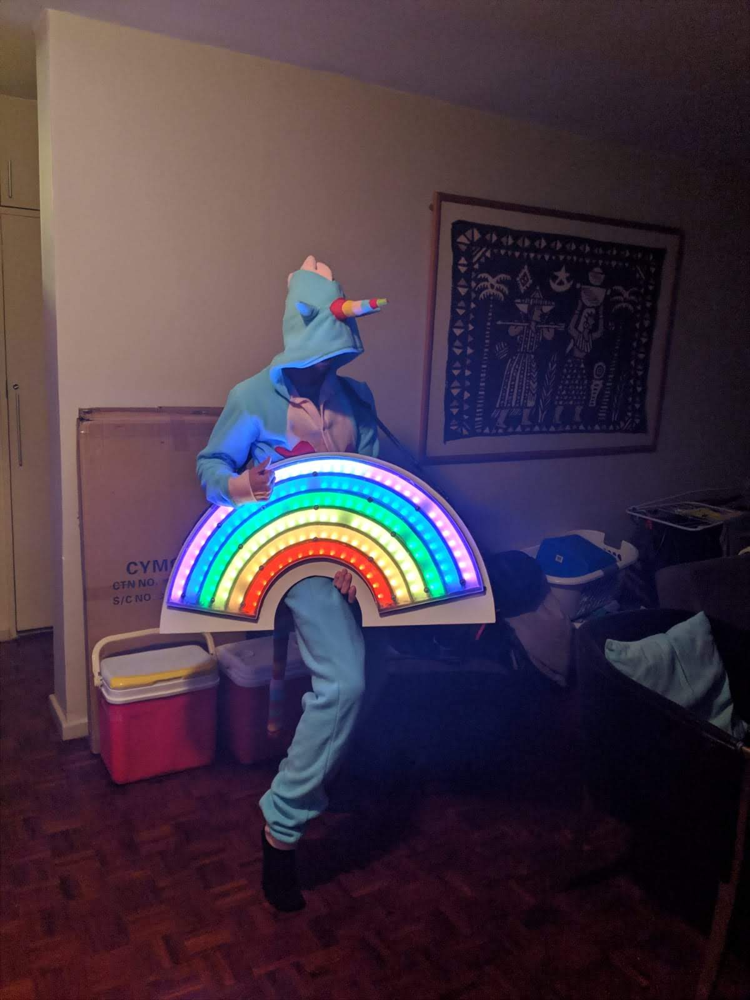
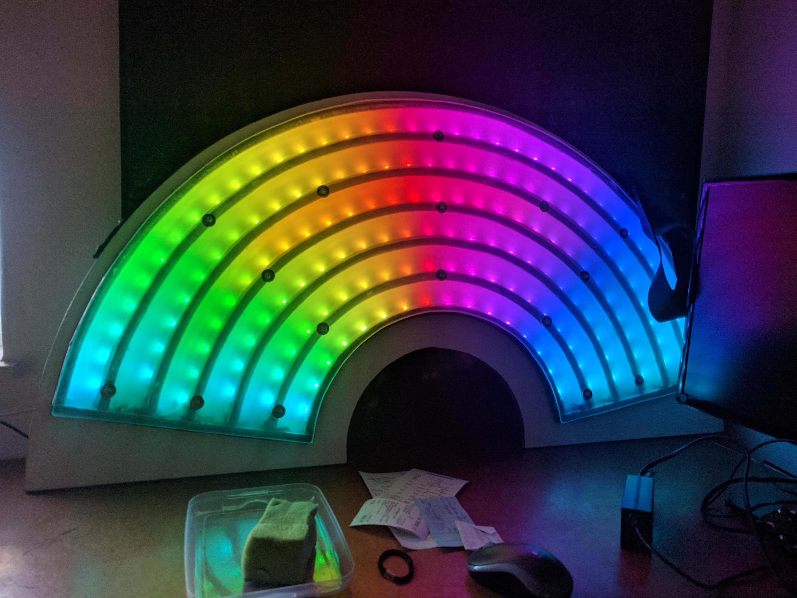
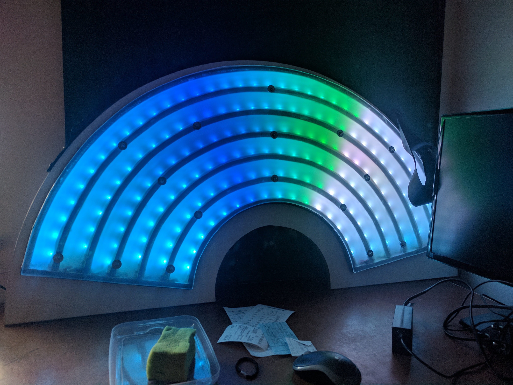
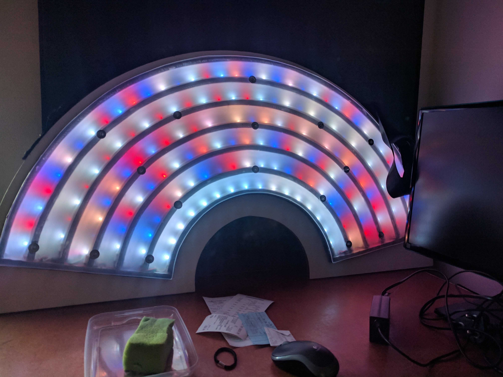
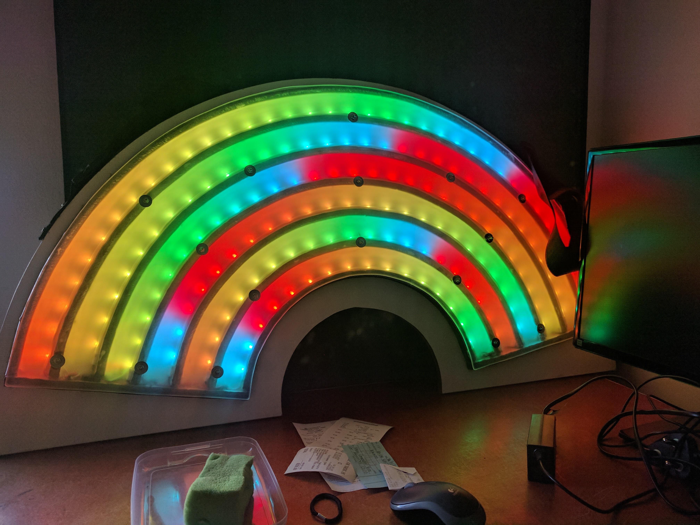

# The unicorn's rainbow

This 1m large rainbow was to complement a Unicorn-Onesie with a light show.

It would run different animations and could even show text.
It contains more than 100 LEDs controlled by a raspberryPi.
A battery pack and guitar strips made it portable.

The project was a great success at Afrikaburn...

## Images 
 

